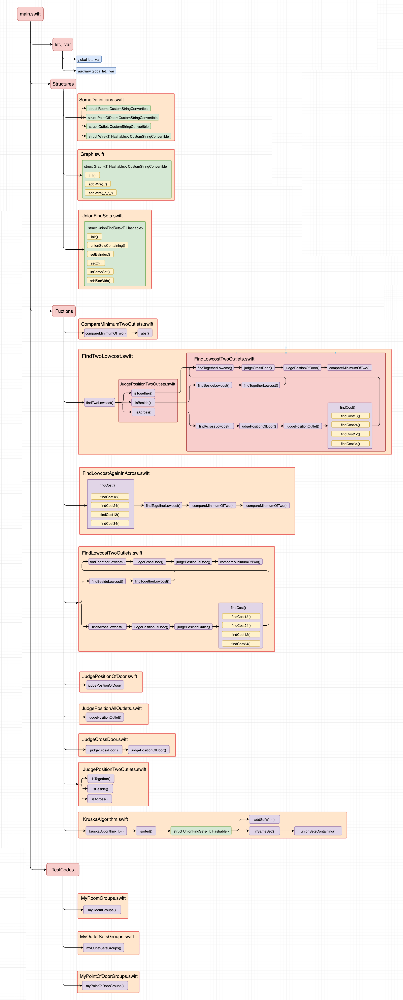

    
    +
    

# 数据结构课程设计之最小生成树的应用：室内布线

## 1 问题内容与目的要求

求解最优化问题的算法通常需要经过一系列的步骤，在每个步骤都面临多种选择。对于许多最优化问题，使用动态规划算法求最优解显得大材小用，可以使用更简单、更高效的算法。贪心算法就是这样的算法，它在每一步都做出当时看起来最佳的选择。也就是说能找到最优解的最优化问题。贪心算法并不能保证得到最优解，但对很多问题确实可以求得最优解。

贪心方法是一种强有力的算法设计方法，可以很好的解决很多问题。采用贪心策略设计的算法就有很多，包括最小生成树的Prim算法和Kruskal算法、单源最短路径的Dijkstra算法，以及集合覆盖问题的Chvatal贪心启发式算法。

本课题的目的是设计一个程序，来帮助房主完成装修新房子这项颇为复杂的工程的室内电线的布局，具体内容如下：

首先，墙壁上插座的位置是固定的，插座间需要有电线相连，而且要布置得整齐美观，即要求每条线都与至少一条墙边平行，且嵌入四壁或者地板（不能走屋顶）。

房主要求知道，要将所有插座连通，自己需要买的电线最短长度。

另外，别忘了每个房间都有门，电线不可以穿门而过，上图给出了一个有4插座的房子的电线布局。

**输入要求：**

输入由若干组测试数据组成。

每组数据的第1行包含房间的长、宽、高和插座的个数N（N为一个不超过20的正整数）。

接下去的N行中，第i行给出第i个插座的位置坐标(xi, yi, zi)；最后一行包含4个3元组(x1, y1, z1) 、(x2, y2, z2) 、(x3, y3, z3)、 (x4, y4, z4)，分别是长方形门框的4个角的三维坐标。4个数字全部为0表示全部测试结束，不要对该数据做任何处理。

注意：这里假设长方形形状的房间完全位于三维直角坐标系的第一象限内，并且有一个角落在原点上。地板位于x-y平面。题目数据保证，每个插座仅属于四面墙中的一面，门上没有插座。要求每段电线的两端必须仅与插座连接，电线之间不能互相交叉焊接。

**输入数据：**

| **房子（长:宽:高）** | **门（x:y:z）** | **插座坐标（x:y:z）** |
| :-: | :-: | :-: |
| (10:10:10) | (10:10:10) | (20:15:20) |

**输出要求**：

对每一组测试，在一行里输出要将所有插座联通需要买的电线的最短整数长度。

**输出数据：**

| **理论值** | 20.3 |
| :-: | :-: |
| **上取整** |  21  |

因此，本课题的实验任务要求如下：

（1）创建房子，门，插座，并且它们的长度和坐标均为非负数，插座上限为20个；

（2）地板位于x-y平面；

（3）做到室内布线美观，即插线拐角、转角少，布线平行墙边和地脚线，不能走屋顶，插线不能交叉焊接；

（4）判断插座同墙，邻墙和对墙三种情况的布线的求解，以及有门的情况如何求解；

（5）使用最小生成树算法完成室内最短布线的求解。

## 2 **概要设计**

### 2.1 **系统功能模块**

### 2.2 **函数调用关系图**

